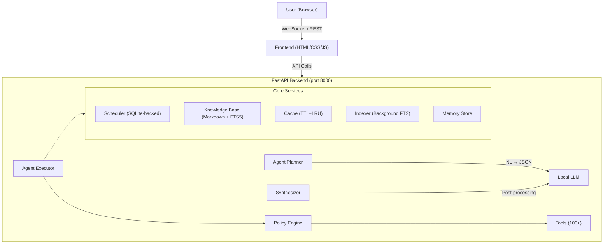

# 🤖 AEGIS — Autonomous OS Intelligence Agent

Natural language → Plan → Safe execution on your entire desktop.  
Powered by **any local LLM** (LM Studio, Ollama, or any OpenAI-compatible API).  
**100% offline. No data leaves your machine.**

## UI


---

## ✨ Feature Overview

### Core Intelligence
| Feature | Description |
|---------|-------------|
| 🧠 **AI Chat Agent** | Natural language → structured plan → user approval → safe execution |
| 🗂️ **File Explorer** | Full file manager: browse, search, create, move, copy, rename, trash, restore |
| 📄 **Document Understanding** | Summarize, explain, compare, extract tables (PDF, DOCX, XLSX, PPTX, images) |
| 🖼️ **Image Intelligence** | Describe, OCR, find similar, search by description |
| 🔐 **Security & Privacy** | Sensitive data detection, AES-256 encryption, secure delete, permission management |
| 🔍 **Advanced Search** | Full-text, semantic, code-aware, document-internal, FTS5-indexed instant search |
| 🌿 **Git Integration** | status, add, commit, diff, log, branch, checkout, push, pull |
| 💻 **Interactive Terminal** | Full PTY shell via xterm.js — nano, htop, git — all work |
| 🌐 **Web Intelligence** | DuckDuckGo search + BeautifulSoup scraper |
| 📊 **System Monitor** | CPU/core, RAM, Disk I/O, Network, GPU (nvidia-smi), process tree |
| 🔢 **Multi-Step Reasoning** | Auto-chains: search → filter → act. No file paths needed |

### OS Assistant
| Feature | Description |
|---------|-------------|
| 🖥️ **Desktop Control** | Clipboard R/W + history, screenshots (full/window/region), native notifications, window management (list/focus/minimize/maximize/close), monitor detection |
| 🔌 **App Plugins** | VS Code open/jump-to-line, Docker (list/start/stop/exec/logs), Package managers (apt/pip/npm/snap/flatpak), HTTP API tester, SQLite query interface |
| ⏰ **Task Scheduler** | SQLite-persisted cron-like jobs: interval, one-shot datetime, or manual. Actions: shell, agent task, desktop notification. Full run history |
| 📚 **Knowledge Base** | Personal markdown wiki with FTS5 search, tag/project organization, backlinks, YAML frontmatter, import arbitrary text |
| ⚡ **Performance Layer** | TTL+LRU metadata cache (5000 entries), parallel async directory scanner (8 workers) |
| ⚙️ **Config Management** | Dotfile enumeration, installed package export, safe env var inspection |

### Voice & Audio Intelligence
| Feature | Description |
|---------|-------------|
| 🎙️ **Offline STT** | 100% Offline Speech-to-Text (`faster-whisper` / `openai-whisper`) |
| 🔊 **Offline TTS** | Offline Text-to-Speech (`pyttsx3` / `espeak`) for agent responses |
| 🎵 **Audio Library** | Audio Metadata Extraction (`ffprobe` / `mutagen`), batch transcription |

---

## 🚀 Quick Start

Please refer to `Usage_instructions.md` for complete setup and execution commands.

---

## 🏗️ Architecture



---

## 📁 Project Structure

```
OS_Agent/
├── backend/
│   ├── agent/            # NL → JSON plan, executor, synthesizer
│   ├── api/              # REST + WebSocket endpoints
│   ├── tools/            # 100+ tools (file, search, desktop, voice, etc.)
│   ├── scheduler/        # SQLite-backed task scheduler
│   ├── knowledge/        # Personal markdown wiki
│   ├── cache/            # TTL+LRU cache layer
│   ├── indexing/         # Background filesystem indexer (FTS5)
│   ├── permissions/      # Allow/deny path validation (policy.py)
│   ├── llm/              # OpenAI-compatible LLM client
│   ├── memory/           # Persistent user preferences
│   ├── database/         # SQLite schema & init
│   ├── config.yaml       # Configuration
│   ├── main.py           # FastAPI app entry point
│   └── requirements.txt
├── frontend/
│   ├── index.html        # UI pages
│   ├── styles.css        # Design system
│   └── app.js            # Frontend logic
├── setup.sh
├── capability_test.py
├── Usage_instructions.md
└── README.md
```

---

## ⚙️ LLM Configuration

Edit `backend/config.yaml` or use the **Settings** page in the UI:

```yaml
llm:
  provider: "lmstudio"           # lmstudio | ollama | openai_compatible
  base_url: "http://localhost:1234/v1"
  model: "gemma-3-4b-it"         # Your loaded model name
  temperature: 0.3
  max_tokens: 4096
```

| Provider | Default URL | Notes |
|----------|-------------|-------|
| LM Studio | `http://localhost:1234/v1` | Load any GGUF model |
| Ollama | `http://localhost:11434/v1` | `ollama pull <model>` first |
| OpenAI-compatible | Varies | vLLM, text-generation-webui, etc. |

---

## 🔌 API Reference

### Core Agent
| Method | Endpoint | Description |
|--------|----------|-------------|
| POST | `/api/chat` | Natural language → plan |
| POST | `/api/approve` | Approve & execute plan |
| POST | `/api/reject/{id}` | Reject plan |
| GET | `/api/tasks` | Task history |
| GET | `/api/tasks/{id}` | Task detail + executions |
| WS | `/ws` | Real-time plan/execution updates |
| WS | `/ws/terminal` | Interactive PTY shell |

### File Explorer
| Method | Endpoint | Description |
|--------|----------|-------------|
| GET | `/api/browse` | List directory contents |
| POST | `/api/fileop/*` | create-file, create-folder, rename, copy, move, trash, delete, compress, extract, restore, organize |

### Search & Indexing
| Method | Endpoint | Description |
|--------|----------|-------------|
| POST | `/api/search` | Advanced metadata search |
| POST | `/api/search/content` | Grep inside file content |
| POST | `/api/search/documents` | Search inside PDFs/Office/OCR |
| POST | `/api/search/semantic` | LLM-powered semantic search |
| GET | `/api/index/search` | Instant indexed filename search |

### System & Desktop
| Method | Endpoint | Description |
|--------|----------|-------------|
| GET | `/api/system/metrics` | CPU/RAM/disk/network/GPU |
| GET | `/api/desktop/clipboard` | Read clipboard content |
| POST | `/api/desktop/screenshot` | Full/window/region screenshot |
| POST | `/api/desktop/notify` | Native desktop notification |

### Scheduler & Knowledge Base
| Method | Endpoint | Description |
|--------|----------|-------------|
| GET/POST | `/api/scheduler/jobs` | Manage scheduled jobs |
| GET/POST | `/api/kb/notes` | Manage markdown notes |

---

## 🛠️ Available Tools (100+)

### Desktop Environment
- `clipboard_read`, `clipboard_write`, `clipboard_history`
- `take_screenshot`, `desktop_notify`
- `list_windows`, `focus_window`, `window_action`, `get_active_window`
- `display_info`

### Application Plugins
- `vscode_open`, `vscode_run_command`
- `docker_list`, `docker_action`, `docker_logs`, `docker_exec`
- `package_manager` (apt/pip/npm/snap/flatpak)
- `http_request`, `sqlite_query`, `sqlite_list_tables`

### Voice & Audio Intelligence
- `transcribe_audio`, `batch_transcribe`
- `text_to_speech`, `save_speech_to_file`
- `audio_info`, `list_audio_files`

### File Operations
- `list_directory`, `read_file_metadata`, `search_files`, `advanced_search`
- `move_file`, `copy_file`, `rename_file`, `delete_file`, `create_directory`
- `compress_files`, `extract_archive`, `trash_file`, `restore_from_trash`

### Search & Document AI
- `search_by_content`, `search_documents`, `semantic_search`, `indexed_search`
- `summarize_document`, `explain_document`, `extract_tables`
- `describe_image`, `ocr_image`, `find_similar_images`

### Security & System
- `view_permissions`, `edit_permissions`, `encrypt_file`, `decrypt_file`
- `system_metrics`, `process_tree`, `terminal_session`, `kill_process`

### Git & Web
- `git_status`, `git_commit`, `git_diff`, `git_pull`, `git_push`
- `web_search`, `web_scrape`

---

## 🔒 Permission System

The agent **cannot bypass** the policy engine. Configure in `config.yaml`:

```yaml
filesystem:
  allowed_paths:
    - "~/Downloads"
    - "~/Documents"
    - "~/Projects"
  denied_paths:
    - "~/.ssh"
    - "/etc"
    - "~/.gnupg"
```

- **Deny rules always win** over allow rules
- Destructive actions (`delete`, `move`, `encrypt`) require explicit user approval
- Every action is logged to SQLite for audit

---

## 🧠 Multi-Step Reasoning

The agent chains operations intelligently. You never need to know file paths.

```
You: "Run backend tests, open failing files in VS Code"

Agent plan:
  Step 1: terminal_session(command="cd ~/Projects/myapp && pytest --tb=short")
  Step 2: semantic_search(query="failed test file")
  Step 3: vscode_open(path=<result from step 2>)
```

```
You: "Every Friday, backup Documents and notify me"

Scheduler job:
  Trigger: interval (7d)
  Action:  shell("tar -czf ~/backups/docs-$(date +%F).tar.gz ~/Documents")
  + notify: "Backup complete"
```

---

## License

MIT
